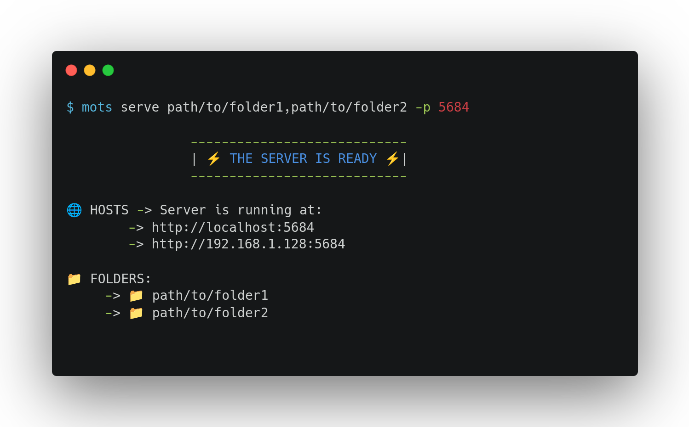

<h1 align=center>MOTS</h1>


<p align=center>
Simple tool for hosting static files and makes fakes APIs to test your apps.
Make with ❤️ and Typescript by Yoannis Sánchez Soto</p>




## 🚀 Features

* Intuitive and easy to use commands
* CORS enabled by default
* Hosts multiple folders
* Makes fake APIs to test your apps **PREFABS**

## 📦 Prefabs

MOTS allows you to create fake apis called Prefabs, these are configurable files with the structure of an API able to respond to parameters and define a response based on this, it can be a file, an html page or anything.

This feature is intended to help developers to test their apps without the need to have developed an API before or without the need to be connected all the time.

### Creating Prefabs

To create a new Prefab you must enter the following command

    mots prefab create [NAME]
Just provide a name for the new Prefab.

It will indicate the folder on your computer where it has been saved. For example

    💾 Prefab Saved in /home/user/.local/share/mots/prefabs/new.json

This newly created prefab already has a default structure designed as a starting point, now try to serve it with the following command
  
     mots prefab [NAME]

Try entering in your browser the following url to see the change of the parameters **localhost:4004/?user=you**

All prefabs contain the following structure

``` json
{
  "port": 4004,
  "paths": [
    {
      "name": "",
      "folder": "",
      "response": "<h1>MOTS loves you $USER</h1><h2>Add ?user=[ANY] to url to change the bear for a name or anything else</h2>",
      "params": [{ "name": "user", "default": "🐼", "isRequired": false }],
      "status": 200
    },
    {
      "name": "/Error",
      "folder": "",
      "response": "<h1>Not Found</h1>",
      "status": 404
    },
    {
      "name": "/Success",
      "folder": "",
      "response": "<h1>Yes, you can 🔥</h1>",
      "status": 200
    }
  ]
}

```

As you can see they are json files, with different properties easy to understand for any programmer 😁

## 👥 Contribution

Any contribution is always welcome. Please let me know of any bugs you detect in MOTS.

## 👨‍💻 Usage
<!-- usage -->
```sh-session
$ npm install -g mots
$ mots COMMAND
running command...
$ mots (--version)
mots/0.0.8 linux-x64 node-v16.17.0
$ mots --help [COMMAND]
USAGE
  $ mots COMMAND
...
```
<!-- usagestop -->
### Commands
<!-- commands -->
* [`mots about`](#mots-about)
* [`mots config`](#mots-config)
* [`mots config datadir`](#mots-config-datadir)
* [`mots help [COMMAND]`](#mots-help-command)
* [`mots prefab PREFAB`](#mots-prefab-prefab)
* [`mots prefab create PREFAB`](#mots-prefab-create-prefab)
* [`mots serve [FOLDER]`](#mots-serve-folder)

## `mots about`

Show About

```
USAGE
  $ mots about

DESCRIPTION
  Show About

EXAMPLES
  $ mots about
```

_See code: [dist/commands/about/index.ts](https://github.com/yossTheDev/mots/blob/v0.0.8/dist/commands/about/index.ts)_

## `mots config`

Configuration of mots

```
USAGE
  $ mots config

DESCRIPTION
  Configuration of mots
```

_See code: [dist/commands/config/index.ts](https://github.com/yossTheDev/mots/blob/v0.0.8/dist/commands/config/index.ts)_

## `mots config datadir`

Show default hosted folder

```
USAGE
  $ mots config datadir

DESCRIPTION
  Show default hosted folder

EXAMPLES
  $ mots config datadir
  /home/USER/.local/share/mserv
```

## `mots help [COMMAND]`

Display help for mots.

```
USAGE
  $ mots help [COMMAND] [-n]

ARGUMENTS
  COMMAND  Command to show help for.

FLAGS
  -n, --nested-commands  Include all nested commands in the output.

DESCRIPTION
  Display help for mots.
```

_See code: [@oclif/plugin-help](https://github.com/oclif/plugin-help/blob/v5.1.12/src/commands/help.ts)_

## `mots prefab PREFAB`

Host Prefabs locally. Prefabs are Json files that contains the structure of an API

```
USAGE
  $ mots prefab [PREFAB]

ARGUMENTS
  PREFAB  Prefab to be hosted

DESCRIPTION
  Host Prefabs locally. Prefabs are Json files that contains the structure of an API

EXAMPLES
  $ mots prefab
```

_See code: [dist/commands/prefab/index.ts](https://github.com/yossTheDev/mots/blob/v0.0.8/dist/commands/prefab/index.ts)_

## `mots prefab create PREFAB`

Create a new prefab with the default structure in the Prefabs folder

```
USAGE
  $ mots prefab create [PREFAB]

ARGUMENTS
  PREFAB  Name of Prefab to be created

DESCRIPTION
  Create a new prefab with the default structure in the Prefabs folder

EXAMPLES
  $ mots prefab create
```

## `mots serve [FOLDER]`

Initialize Server

```
USAGE
  $ mots serve [FOLDER] [-p <value>]

ARGUMENTS
  FOLDER  (Optional) Folder to be hosted. If it is not provide default Public folder is served, write config datadir to
          show the default public directory location

FLAGS
  -p, --port=<value>  App PORT Ex:8080. If this is not defined default port has to be used (4000)

DESCRIPTION
  Initialize Server

EXAMPLES
  $ mots serve path/to/folder -p 8080
```

_See code: [dist/commands/serve/index.ts](https://github.com/yossTheDev/mots/blob/v0.0.8/dist/commands/serve/index.ts)_
<!-- commandsstop -->
